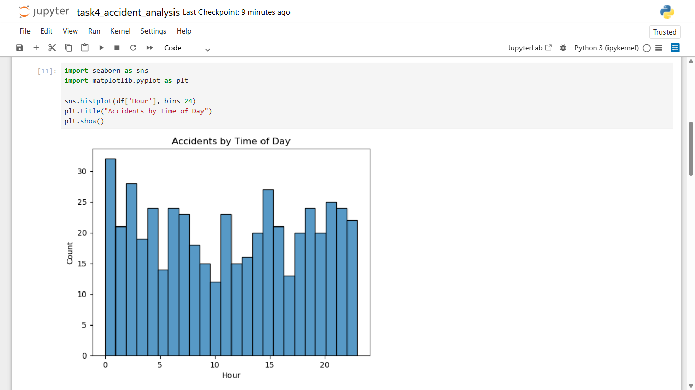
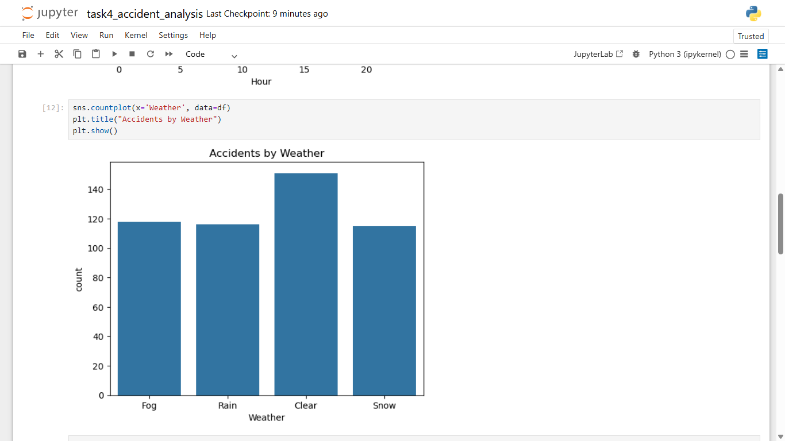
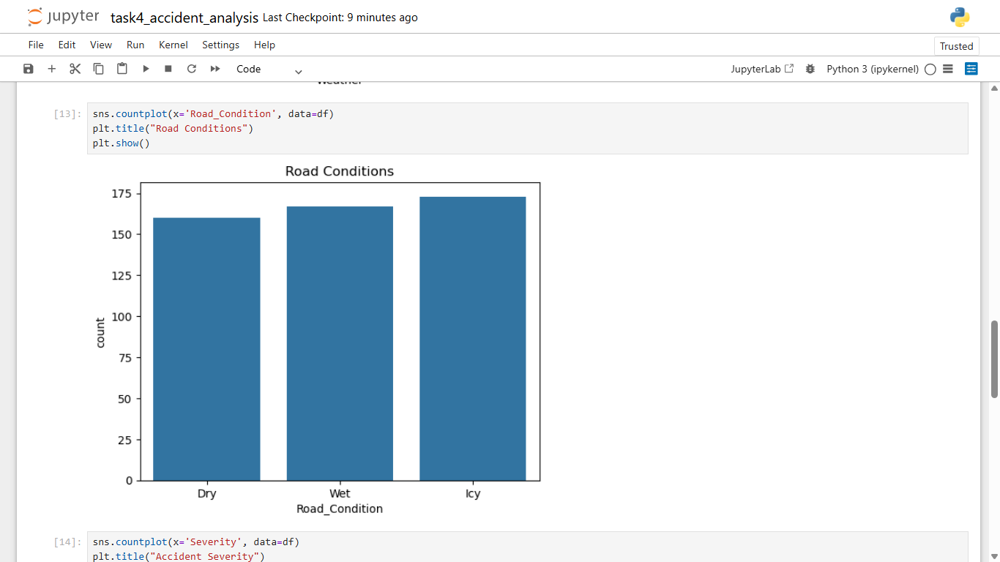
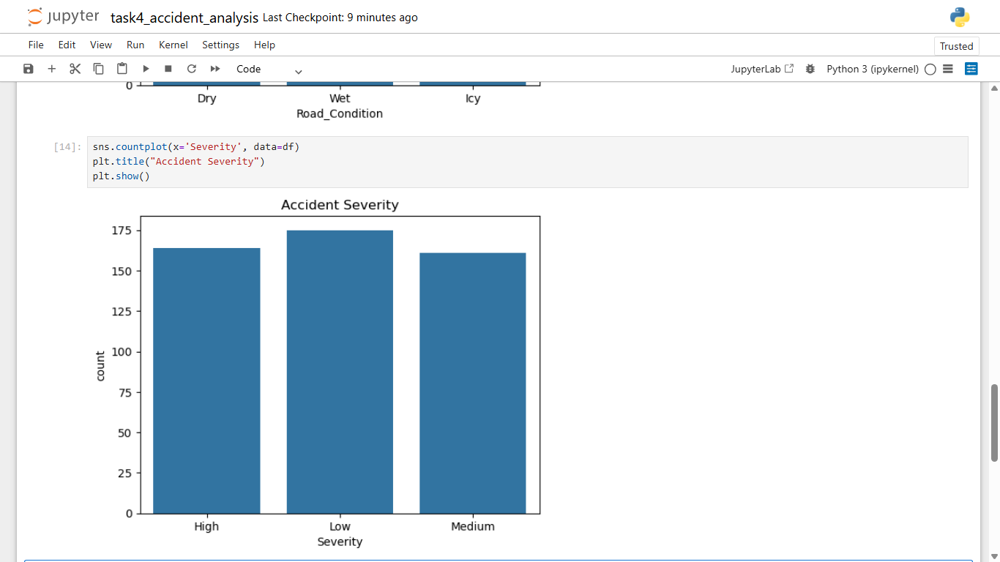

# Task 4: Traffic Accident Analysis

## Objective

To analyze traffic accident data and identify patterns related to time, weather, and road conditions.

## Tools Used

- Python
- Pandas
- Matplotlib
- Seaborn

## Dataset

Synthetic traffic accident dataset generated using Python.

## Process

- Created dataset with accident-related features
- Analyzed time, weather, and road conditions
- Visualized patterns using graphs
- Identified key trends

## Key Insights

- Accidents vary across different times of the day
- Weather conditions impact accident occurrence
- Road conditions influence accident severity
- Certain patterns can help in accident prevention

## Visualizations

## Files Included

- task4_accident_analysis.ipynb
- screenshots
- task4_execution.mp4
